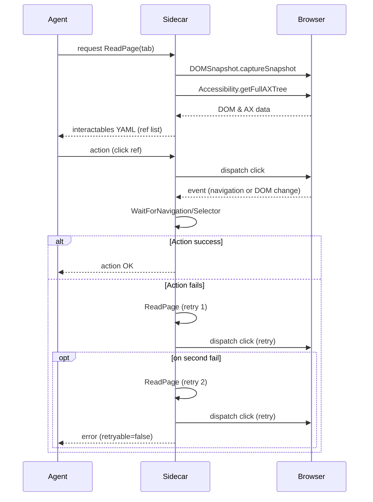

<answer>

## Executive summary  
This report breaks the New Browser **PRD** into modular implementation tasks. Each task is described with its **goal**, inputs/outputs, preconditions, detailed steps, CDP calls (with TypeScript snippets), data schemas, acceptance tests, effort estimate, and dependencies. The tasks cover page perception (ReadPage), communication channels (SSE/WebSocket), sidecar infrastructure (CDP session management, tools), automation tools (click, type, navigation, forms, tabs), BlockedDomains enforcement, observability/logging, safety gating, and deployment options. We include comparison tables for SSE/WebSocket libraries/providers and mermaid diagrams for ReadPage+Action flow and the sidecar architecture. 

## Task decomposition

### Task 1: Page perception (`ReadPage` implementation)  
**Goal:** Capture the current page’s interactable elements as a YAML-like tree.  
**Inputs:** Active `tab_id`, prior `page_loaded` state.  
**Outputs:** Structured tree (YAML string + JSON) of interactable nodes with unique `ref_id`, roles/names, bounding boxes (viewport coords), and clickable status.  
**Preconditions:** Browser tab is at the correct URL and fully loaded. CDP session attached, with `Accessibility.enable()` called.  

**Blueprint:**  
- **1. Frame discovery:** Use `Page.getFrameTree` to list frames. For each frame, note its `frameId`. (We rely on [Page.getFrameTree](https://chromedevtools.github.io/devtools-protocol/tot/Page/#method-getFrameTree) to get frames.)  
- **2. DOMSnapshot:** For each frame, call `DOMSnapshot.captureSnapshot({computedStyles:["display","visibility"], includeDOMRects: true})`. Store result’s `documents` array. This returns flattened DOM, layout, and styles【4†L78-L81】.  
- **3. Compute bounding boxes:** For each `DocumentSnapshot`, map `layout.nodeIndex` to `layout.bounds` (absolute coords, scroll offset ignored【8†L540-L548】). Subtract `scrollOffsetX/Y` to get viewport box. (If `includeDOMRects` was true, we could use `offsetRects` too.)  
- **4. Accessibility:** For each frame, call `Accessibility.getFullAXTree({depth: 99999, frameId: <frameId>})` to get AXNode list (requires `Accessibility.enable()` first【10†L83-L85】【10†L135-L142】). This yields all semantic nodes.  
- **5. Filter interactables:** From each AXNode: skip if `ignored` or hidden. Keep nodes where `role` is a known control (button, link, textbox, etc.) or `properties` includes `focusable: true` or `editable: true`【22†L142-L149】. Also include any with `isClickable` true from DOMSnapshot (via its RareBooleanData index list【8†L690-L696】) even if not in AX (for e.g. clickable `<div>`).  
- **6. Build hierarchical tree:** For readability, group nodes by their AX parent chain but only output the interactable nodes. Assign each node a synthetic `ref_id = frameOrdinal:backendNodeId` (ensuring uniqueness across frames【24†L186-L190】). Use Stagehand’s approach: when encountering an AX node with role `Iframe`, recursively process its child frame. Use `DOM.getFrameOwner(frameId)` to map child frames to their iframe element for coordinate offset.  
- **7. YAML conversion:** Format the list of interactables into YAML-like text under their frame. Include fields: role, name (if any), `ref_id`, and `bbox: {x, y, w, h}`, plus example `click: {x, y}` for click target (e.g. center). Example snippet:
  ```yaml
  - ref_id: f0:812
    role: "textbox"
    name: "Email"
    bbox: {x: 212, y: 188, w: 420, h: 38}
    click: {x: 422, y: 207}
    actions: ["click","type"]
  ```  
- **8. Return structure:** Output this YAML string plus a JSON object containing the tree and raw data for logging.  

**CDP calls (TypeScript sketch):**  
```ts
// 1. Get frame tree
const {frameTree} = await cdp.Page.getFrameTree();
// e.g., gather frameIds and parent-child
// 2. Capture DOM snapshot (root frame)
const {documents, strings} = await cdp.DOMSnapshot.captureSnapshot({
  computedStyles: ["display", "visibility"],
  includeDOMRects: true
});
// 3. Accessibility
const axRes = await cdp.Accessibility.getFullAXTree({depth: 100});
const axNodes: AXNode[] = axRes.nodes;
// 4. Filter interactable nodes
const interactables: Array<AXNode & {frameId: string}> = axNodes.filter(ax =>
  ax.role?.value && controlRoles.has(ax.role.value) ||
  ax.properties?.some(p => (p.name==="focusable" || p.name==="editable") && p.value.value === true)
);
// 5. Map backendNodeId to bbox from snapshot
const rectMap = new Map<number, Rect>();
const doc = documents[0]; // assuming single doc for simplicity
for(let i=0; i<doc.layout.nodeIndex.length; i++){
  const nodeIdx = doc.layout.nodeIndex[i];
  const bId = doc.nodes.backendNodeId[nodeIdx];
  const [x,y,w,h] = doc.layout.bounds[i];
  rectMap.set(bId, {x: x - doc.scrollOffsetX, y: y - doc.scrollOffsetY, width: w, height: h});
}
// 6. Build YAML tree of interactables with ref_ids
const yamlLines: string[] = [];
for(const ax of interactables){
  const frameOrdinal = frameMap.get(ax.frameId); // map frames to e.g. "f0"
  const refId = `${frameOrdinal}:${ax.backendDOMNodeId}`;
  const name = ax.name?.value || "";
  const bbox = rectMap.get(ax.backendDOMNodeId) || {x:0,y:0,w:0,h:0};
  yamlLines.push(`- ref_id: "${refId}"`);
  yamlLines.push(`  role: "${ax.role?.value || ''}"`);
  if(name) yamlLines.push(`  name: "${name}"`);
  yamlLines.push(`  bbox: {x: ${bbox.x}, y: ${bbox.y}, w: ${bbox.width}, h: ${bbox.height}}`);
  yamlLines.push(`  click: {x: ${bbox.x + bbox.width/2}, y: ${bbox.y + bbox.height/2}}`);
}
const yamlOutput = yamlLines.join("\n");
```

**Data schemas:**  
```json
// Tool Request Envelope
{
  "request_id": "string",
  "action": "ReadPage",
  "tab_id": "<tab_id>",
  "params": {}
}
// Example snippet of Tree node
{
  "ref_id": "f0:812",
  "role": "textbox",
  "name": "Email",
  "bbox": {"x":212,"y":188,"w":420,"h":38},
  "click": {"x":422,"y":207},
  "actions": ["click","type"]
}
```  

**Acceptance tests:**  
- *Pass:* On a sample page with known interactables, ReadPage returns YAML listing only those elements. E.g., for a page with a button labeled "Submit", test sees a YAML entry with role `button` and name "Submit". Coordinates must match the element’s bounding box (±5px).  
- *Fail:* Missing an obvious button/link; incorrect coordinates (e.g., negative or far outside viewport); duplicating ref_id; including a non-interactable element.  
- *Edge:* Confirm that cross-frame elements are captured under the correct frame and that backendNodeId uniqueness is maintained by frame context (per【24†L186-L190】).  

**Effort:** Medium (involves CDP calls, frame logic, YAML formatting).  
**Dependencies:** CDP session setup, frame-attaching (Task 2), frame owner lookup for nested frames.

### Task 2: CDP session and frame management  
**Goal:** Manage CDP sessions for multiple tabs/frames and maintain a registry.  
**Inputs:** None (initial setup).  
**Outputs:** A mapping of `tab_id` to CDP target/session, and a frame tree with unique identifiers.  
**Preconditions:** Browser launched with remote debugging.  

**Blueprint:**  
- **1. Attach to tab:** After `Target.createTarget`/opening tab, call `Target.attachToTarget({targetId, flatten: true})` to get `sessionId`【16†L139-L147】. Store `sessionId` per `tab_id`.  
- **2. Enable domains:** For each new session, call `Accessibility.enable`, `DOM.enable`, `Network.enable`, etc., as needed. (Enabling Accessibility is necessary for consistent AXNodeIds【10†L83-L85】.)  
- **3. Frame registry:** Call `Page.enable()` and `Page.getFrameTree`. Store each frame’s `frameId`, parent, and associated sessionId (use `Target.attachToTarget({targetId: frame.targetId})` if different). This allows routing CDP commands to the correct frame via `sessionId` with optional `frameId` param.  
- **4. Handle frames:** When a frame is attached (e.g. via `Target.attachedToTarget` event), record mapping from frame to session. Use `DOM.getFrameOwner(frameId)` to link `frameId` to iframe element’s node. If iframes are out-of-process, use `Target.attachToTarget` with `flatten:true` and `id` param.  

**CDP calls:**  
```ts
// Attach and flatten
const { sessionId } = await cdp.Target.attachToTarget({targetId: myTargetId, flatten: true});
// Enable accessibility for stable IDs
await cdp.send('Accessibility.enable', {}, sessionId);
// Get frames
const {frameTree} = await cdp.send('Page.getFrameTree', {}, sessionId);
```

**Acceptance tests:**  
- *Pass:* New tabs/iframes show up in registry with unique IDs. After an iframe navigation, `Page.frameNavigated` updates frame list.  
- *Fail:* Sending a command to the wrong session causes error or no effect. Missing session attach results in inaccessible frames.  

**Effort:** Small.  
**Dependencies:** none.

### Task 3: Sidecar RPC and streaming endpoints  
**Goal:** Implement two channels between UI and sidecar: an SSE stream and a WebSocket RPC.  
**Inputs:** None (setup server).  
**Outputs:** SSE HTTP endpoint and WS server endpoint.  
**Preconditions:** Sidecar is running (Node/Express or similar).  

**Blueprint:**  
- **1. SSE (Server-Sent Events) endpoint:** Create a Next.js (or Node) GET endpoint `/events`. It returns a streaming `Response` with `Content-Type: text/event-stream; charset=utf-8`. Use a `ReadableStream` (or Node streams) to flush chunks. On each event/log/narrative step, `enqueue` a line prefixed by `"data: "` and terminated by `"\n\n"`. (E.g. `controller.enqueue(encoder.encode("data: Step 1 complete\n\n"));`). Reference pattern from [18†L25-L33]. Ensure to disable default caching/edge: `Cache-Control: no-cache` and `Connection: keep-alive`.  
- **2. WebSocket server:** In the sidecar, use a WS library (e.g. `ws`) to listen on a port (e.g. 3001). Accept connections from UI and dispatch messages. For simplicity, a JSON-RPC style: messages are `{request_id, action, tab_id, params}`; responses mirror `{ok, result/error, retryable}`. Example:  
  ```ts
  wss.on('connection', socket => {
    socket.on('message', async msg => {
      const req = JSON.parse(msg as string);
      const {request_id, action, tab_id, params} = req;
      try {
        const result = await handleTool(action, tab_id, params);
        socket.send(JSON.stringify({request_id, ok: true, result}));
      } catch (e) {
        socket.send(JSON.stringify({request_id, ok: false, error: e.message, retryable: isTransient(e)}));
      }
    });
  });
  ```  
- **3. Next.js client:** Use `@microsoft/fetch-event-source` to connect to the SSE endpoint in the sidecar or BFF【18†L7-L10】. For the WebSocket, use the browser `WebSocket` API to connect.  
- **4. Library choices:** SSE: on client use `eventsource-parser` for streaming parse. WS: on server, `ws` library is lightweight【22†L142-L149】.  
- **5. Vercel compatibility:** If deploying UI on Vercel, note WS unsupported; use external provider (see Task 5). SSE endpoints in Next.js route handlers use ReadableStream (supported by Vercel)【18†L7-L10】.  

**Comparison table:**

| Channel         | Options (server)         | Pros                      | Cons                          | Vercel fit?                  |
|-----------------|--------------------------|---------------------------|-------------------------------|------------------------------|
| **SSE**         | Native Stream + Next.js  | HTTP-only, simple text    | One-way (server→client only)  | Supported (Readables)       |
| **Client-side** | `@microsoft/fetch-event-source` / `eventsource-parser` | Handles reconnect, streaming parse  |                         |
| **WebSocket**   | `ws`, `uWebSockets.js`   | Full-duplex, low latency  | More complex state management | Requires external provider【20†L39-L48】 |
|                 | `Socket.IO`              | Auto-reconnect, fallback  | Not supported on Vercel (see KB) |                            |
|                 | Services: Ably, PartyKit | Managed scalable WS       | Vendor lock-in / cost         | Supported (list in KB)【20†L39-L48】 |
| **Client-side** | `WebSocket` API          | Standard in browsers      | Needs reconnection logic      |                            |

**Acceptance tests:**  
- *Pass:* UI successfully receives SSE messages in order (check with sample messages). WS RPC round-trips requests (ping→pong).  
- *Fail:* No streaming chunks (e.g. stuck buffered) or WS disconnects immediately.  
- *Edge:* SSE when Vercel caches (must disable caching as above).  

**Effort:** Medium.  
**Dependencies:** Next.js route handler (or separate Node service) framework.

### Task 4: Automation tools – Browser action wrappers  
Implement tool endpoints for user actions: click, type, scroll, key, drag, etc. (the **ComputerBatch** tool) and others.

**4a. Click/Type/Key/Scroll actions:**  
**Goal:** Provide low-level actions for clicking, typing, keypressing, scrolling via CDP.  
**Inputs:** `tab_id`, element ref or coordinates, key codes/text.  
**Outputs:** success/fail, possibly updated screenshot.  
**Preconditions:** Page is at expected state (e.g. after `ReadPage`).  

**Blueprint:**  
- **Click:** Given `ref` (from ReadPage) or x,y coords, use `DOM.resolveNode({backendNodeId})` to get `objectId`, then `DOM.scrollIntoViewIfNeeded({backendNodeId})`, then `Input.dispatchMouseEvent({type:"mousePressed",x,y, button:"left"})` followed by `mouseReleased`. Coordinates are relative to main frame viewport【4†L78-L81】【4†L78-L81】.  
- **Type:** Given `ref`, use `DOM.resolveNode` → `objectId`, then `Runtime.callFunctionOn` to `focus()` on element, then for each character: `Input.insertText` with the char. Alternatively use `DOM.focus` + `Input.dispatchKeyEvent`.  
- **Key:** Use `Input.dispatchKeyEvent` with `type:"keyDown"`/`keyUp` for key actions (e.g. Enter).  
- **Scroll:** Use `Input.dispatchMouseEvent` with `type:"mouseWheel"` and `deltaX/deltaY`, or `DOM.scrollIntoViewIfNeeded` for an element then `Input.dispatchMouseEvent`.  
- **Drag (optional):** Click+move offset+release via `Input.dispatchMouseEvent`.  

**CDP snippets:** (click example)  
```ts
// Suppose ref = {backendNodeId: N, x: 100, y: 200}
await cdp.DOM.resolveNode({backendNodeId: N}).then(r=>r.node); // ensure node exists
await cdp.DOM.scrollIntoViewIfNeeded({backendNodeId: N});
await cdp.Input.dispatchMouseEvent({
  type: 'mousePressed', button: 'left', x: clickX, y: clickY, clickCount: 1
});
await cdp.Input.dispatchMouseEvent({
  type: 'mouseReleased', button: 'left', x: clickX, y: clickY, clickCount: 1
});
```  

**Acceptance tests:**  
- *Pass:* Clicking a known button leads to expected page change (verified by URL or element). Typing text populates input fields.  
- *Fail:* Action fails silently (e.g. element not found), or wrong element clicked (wrong coords).  
- *Retry logic:* If click fails, `ReadPage` must be retried (see Task 7).  

**Effort:** Small.  
**Dependencies:** ReadPage data, Wait tools, retry logic.

**4b. Navigation tool:**  
**Goal:** Handle URL changes and history.  
**Inputs:** `tab_id`, action: `navigate(url)`, `back`, `forward`.  
**Outputs:** navigation result and updated page state.  
**Preconditions:** Tab exists.  

**Blueprint:**  
- Use `Page.navigate({url})` and wait for `Page.loadEventFired`.  
- For back/forward, use `Page.navigate` with `historyId` or simply JS `history.back()` via `Runtime.evaluate`. Simpler: maintain own stack or use `Page.navigate({url: 'back'})` isn't a method; use `Page.goBack()` if exists, or `Runtime` call `window.history.back()`. Then wait for navigation.  
- After navigation, always call `ReadPage` before proceeding.  

**Acceptance tests:**  
- *Pass:* After navigate to “example.com/page2” URL, `get_page_text` contains “Welcome to page 2”.  
- *Fail:* Navigation does nothing or goes to wrong page.  

**Effort:** Small.  
**Dependencies:** CDP Page domain (load events).

**4c. FormInput tool:**  
**Goal:** Set form fields by reference.  
**Inputs:** `ref` (input, select, checkbox), value (string or boolean).  
**Outputs:** `ok`.  
**Preconditions:** Correct refs from ReadPage.  

**Blueprint:**  
- Use `Runtime.callFunctionOn` on element handle: e.g. `element.value = "value"; element.dispatchEvent(new Event('input'));` for inputs. Or `DOM.setAttributeValue`/`DOM.setNodeValue`.  
- For dropdown, find `<option>` by text and set selected. For checkbox, set `checked`.  
- After setting, optionally fire `input`/`change` events.  

**Acceptance tests:**  
- *Pass:* Field value changed (verify via `Runtime.evaluate('element.value')`).  
- *Fail:* Value ignored or wrong field set.  

**Effort:** Small.  
**Dependencies:** ReadPage refs, Runtime domain.

**4d. Tab Operations:**  
**Goal:** Create, switch, group, and close tabs.  
**Inputs:** action type, `tab_id`, parameters (e.g. URL).  
**Outputs:** updated tab list.  
**Preconditions:** Browser launched.  

**Blueprint:**  
- **Create:** `Target.createTarget({url})` returns a new targetID; attach and store as new `tab_id`.  
- **Switch:** Activate (bring to front) a given tab; may use `Target.activateTarget({targetId})`. Then attach context.  
- **Group (optional):** Chrome has tab groups API via extension; likely skip or note “unspecified (beyond scope)”.  
- **Close:** `Target.closeTarget({targetId: ...})` for that tab.  
- Update internal tab registry.  

**Acceptance tests:**  
- *Pass:* New tab opens at given URL. Closing removes it (no longer navigable). Switching changes focus.  
- *Fail:* Tab not found or never closes.  

**Effort:** Small.  
**Dependencies:** Session management (Task 2).

### Task 5: Dual-channel communication libraries & providers  
**Goal:** Identify and evaluate libraries for SSE and WebSocket in Next.js.  

**Blueprint:**  
- SSE client: `@microsoft/fetch-event-source` (supports auto-reconnect, incremental parsing)【18†L25-L33】, `eventsource-parser` (stream parsing). We cite the concept from [18].  
- WebSocket server: `ws` (simple, performs best in Node)【22†L142-L149】; `uWebSockets.js` (blazing speed, low footprint); `socket.io` (feature-rich but not Vercel-friendly).  
- WebSocket providers (for Next.js/Vercel): List from [20] (Ably, PartyKit, etc.) in table.  

**Comparison table:**  

| Channel | Library/Provider        | Pros                                     | Cons                                     | Best for              |
|---------|------------------------|------------------------------------------|------------------------------------------|-----------------------|
| SSE     | `@microsoft/fetch-event-source`【18†L25-L33】 | Native fetch-based SSE, reconnect logic | Browser client only, no protocols overhead| Narrative streaming   |
| SSE parser | `eventsource-parser`【18†L25-L33】     | Parses SSE stream from fetch response    | Low-level parser only                     | Low-level SSE parsing |
| WS (dev)| `ws`【22†L142-L149】                | Standards-compliant, lightweight         | No built-in reconnection/rooms            | Sidecar RPC channel   |
| WS (dev)| `uWebSockets.js`        | High-performance, scalable              | C++ addon, complex build                  | High-throughput RPC   |
| WS (dev)| `Socket.IO`            | Auto-reconnect, fallback                | Overhead, not supported on Vercel        | Rich features (local only) |
| WS (hosted) | Ably, PartyKit, Pusher, PubNub, Firebase, etc.【20†L39-L48】 | Managed scale, no infra | Vendor lock-in, cost                     | Vercel deployments   |

**Acceptance tests:**  
- *Pass:* Example SSE stream received by client code (`fetchEventSource`) yields messages. WS connection established and JSON RPC works.  
- *Fail:* Browser client fails to connect or parse stream, WS cannot connect (especially on Vercel, confirm providers usage).  

**Effort:** Research-level (documentation and small prototypes).  
**Dependencies:** Task 3 for integration.

### Task 6: Reliability & retry framework  
**Goal:** Implement deterministic waits and retry ladder for actions.  
**Inputs:** Action attempts (click/type/etc.).  
**Outputs:** Success or error with `retryable` flag.  
**Preconditions:** Tools available for wait conditions.  

**Blueprint:**  
- **WaitForNavigation:** After actions that change URL, wait for `Page.loadEventFired` and `Page.frameNavigated` to target URL.  
- **WaitForSelector:** Instead of raw CSS selectors, use ReadPage to verify element reappears. Loop: run ReadPage (get YAML), search for element’s `ref_id` or name, break if found. Timeout after X ms.  
- **WaitForNetworkIdle:** Use `Network.enable` and count inflight requests: treat network idle when no new requests for ~500ms. Alternatively, use CDP’s `Network.loadingFinished` events to count.  
- **Retry ladder:** For each action call, on failure or no effect, do:  
  1. Reread page (Task 1) and recompute target ref (maybe element moved).  
  2. Retry the action.  
  3. Repeat up to 3 times. After 3 failures, respond with `retryable:false`.  

**Acceptance tests:**  
- *Pass:* Intermittent click failures recover by retry: e.g., a modal appears briefly; second try clicks after modal closes.  
- *Fail:* Relying on static waits only; or infinite retry.  
- *Criteria:* Tools auto-verify after each action (via Wait functions) per PRD rules.  

**Effort:** Medium.  
**Dependencies:** All actions (Tasks 4a–4d).

### Task 7: BlockedDomains enforcement  
**Goal:** Enforce domain blacklists from admin/user policies before navigation.  
**Inputs:** URL/hostname to check, user/admin configs.  
**Outputs:** allow/deny decision.  
**Preconditions:** Admin policies loaded from OS.

**Blueprint:**  
- **1. Policy sources:** On startup, load policies from system:  
  - **Windows:** Registry keys `HKEY_LOCAL_MACHINE\Software\Policies\Chromium\URLBlocklist` and `HKCU...`, possibly as JSON strings【1†L183-L192】.  
  - **Mac:** Read Chrome policy plist (URLBlocklist/Allowlist keys)【1†L208-L218】.  
  - **Linux:** Read `/etc/chromium/policies/managed/*.json` and `/etc/opt/chrome/policies/managed/*.json`【1†L238-L247】.  
  Parse JSON to arrays.  
- **2. Combine lists:** Merge admin-managed denies (blocklist) and allows (allowlist). If URLAllowlist present and matches, override block (per [1†L111-L119]).  
- **3. URL filter format:** Use Chrome’s pattern rules【1†L161-L164】. For each URL navigation, check against blocklist patterns and allowlist. Use longest-match rules as in Chrome policies【1†L161-L164】. Implement wildcards (“*” meaning any), scheme matching (http, https, file, chrome, etc.).  
- **4. Hard block list:** Always block `chrome://*`, `file://*` unless explicitly whitelisted by admin【1†L198-L203】.  (Sensitive internal pages policy exists【1†L198-L203】.)  
- **5. Enforcement:** On any navigation command, run filter. If blocked, cancel navigation and respond with error. Provide the matching rule in logs.  

**Acceptance tests:**  
- *Pass:* Admin policy file with `"URLBlocklist": ["*"]` and allow `["example.com"]` results in only example.com allowed (see policy example in [1]L256-265).  
- *Fail:* Allow accidental navigation to `chrome://flags` (must block) or local file.  
- *Edge:* Wildcard and exception precedence as documented: e.g. block `example.com*`, allow `*.example.com` should allow subdomains if more specific.  

**Effort:** Medium (requires careful parsing and testing).  
**Dependencies:** Task 1 & navigation tasks.

### Task 8: Logging and observability  
**Goal:** Record all actions and events in JSONL trace files.  
**Inputs:** Tool requests/responses, CDP calls, timestamps.  
**Outputs:** Appended trace log lines, screenshots.  
**Preconditions:** Filesystem access.

**Blueprint:**  
- Each tool call and event logs a JSON entry with: `timestamp`, `run_id`, `step_index`, `request_id`, `action`, `params`, and result or error.  
- Include correlation IDs (`backend_uuid`, `request_id`) as specified.  
- On `ReadPage`, save YAML output and optionally raw AX/DOMSnapshot as JSON to disk.  
- After click/submit, take a screenshot with `Page.captureScreenshot` and log its path.  
- Use newline-delimited JSON. Eg:  
  ```json
  {"step": 1, "action": "ReadPage", "request_id":"r123","ok":true,"result":{"num_interactables":5}}
  ```  
- Also log internal CDP calls (e.g. `Input.dispatchMouseEvent`).  
- Ensure logs are in chronological order and contain all fields for replay.

**Acceptance tests:**  
- *Pass:* The trace file has entries for every tool call and event, with no missing steps. Screenshots are sequential and named. Correlation IDs match across calls.  
- *Fail:* Missing trace of an action, or corrupted JSON.  

**Effort:** Medium.  
**Dependencies:** All tasks that perform actions.

### Task 9: Safety & permission gating  
**Goal:** Prevent certain actions without user confirmation.  
**Inputs:** Action type from agent, list of irreversible actions (`submit`, `purchase`, etc.).  
**Outputs:** Approval query or proceed.  
**Preconditions:** Defined irreversible action set.

**Blueprint:**  
- Define irreversible action categories: `submit`, `purchase`, `delete`, `login`.  
- When a tool request arrives for an irreversible action, pause and emit an SSE event or response requiring user confirm (with `required_confirmation` flag).  
- Format confirmation as described: `confirm_before= true` in response, with clear message. Await user input.  
- Do not auto-proceed. (Mirror PRD rules in section 5).  

**Acceptance tests:**  
- *Pass:* Trying to execute `submit` without pre-approval yields a confirmation question. With approval, proceeds.  
- *Fail:* Proceeds with purchase without asking (unless pre-approved in the chat).  

**Effort:** Small.  
**Dependencies:** UI logic (sidecar UI to show and receive confirmation).

### Task 10: Deployment considerations  
**Goal:** Support both local and cloud deployment of sidecar/UI.  
**Inputs:** Environment (local vs Vercel).  
**Outputs:** Deployment plan/options.  
**Preconditions:** Code modularized for environment.  

**Blueprint:**  
- **Local:** Sidecar runs on localhost with direct CDP to Chromium. Next.js UI served on local or LAN, connecting to sidecar’s SSE/WS. Use `ws` or `uWebSockets.js` for RPC.  
- **Vercel (Next.js UI):** SSE endpoint can be a route in API (returns `ReadableStream`) or proxied to sidecar on a known port (if sidecar has a public API). WebSocket must use an external provider (PartyKit etc) if UI is on Vercel. One approach: run sidecar as a separate server (e.g., on AWS or local), UI on Vercel connects via websockets to external endpoint.  
- Note: Provide design doc, not implementation here.  

**Acceptance tests:**  
- *Pass:* UI and sidecar communicate correctly in chosen setup (e.g. SSE stream test passes, WS test passes or fails gracefully if using provider).  
- *Fail:* UI deadlocks (e.g. WS attempt on Vercel).  

**Effort:** Small (design-level).  
**Dependencies:** Depends on tasks 3-9 being implemented.

## Sequence diagram: ReadPage → Action → Retry  



## Component diagram: Sidecar, Browser, UI  

```mermaid
graph TD
  subgraph BrowserEnv
    Browser[Browser (Chromium)]
  end
  subgraph SidecarService
    Sidecar[Sidecar Service]
    SSEEndpoint[SSE HTTP/2 stream]
    WSServer[WebSocket RPC]
    Sidecar -->|CDP via debug port| Browser
  end
  subgraph UIApp[Sidecar UI (Next.js)]
    UI[React Sidecar Panel]
    UI -- SSE --> SSEEndpoint
    UI -- WebSocket --> WSServer
  end
```

## Sources 

- Chrome DevTools Protocol docs (DOMSnapshot and Accessibility) for snapshot and AX APIs【4†L78-L81】【10†L83-L85】.  
- Browserbase/Stagehand blog for iframe and AX handling【24†L114-L122】【24†L186-L190】.  
- Chrome Enterprise support for URL blocklist/allowlist syntax and storage paths【1†L238-L247】【1†L161-L164】.  
- Vercel docs listing realtime providers (Ably, PartyKit, etc.)【20†L39-L48】.  
- Velt blog comparing WebSocket libraries (`ws`)【22†L142-L149】.  
- Upstash blog and sample code for SSE in Next.js (ReadableStream API)【18†L25-L33】.  
- Microsoft fetch-event-source (Azure) and eventsource-parser docs (implied usage).  

