# Sidecar Insertable Email Drafts

Date: 2026-03-06
Owner: Codex planning pass
Scope: generic sidecar draft card + focused-page insertion

## Short Plan

### 1. Public interfaces and data shapes

- Add a structured `draft_artifact` to the sidecar result payload instead of trying to scrape email content from `final_answer`.
- Model the artifact as an explicit email draft with `subject`, `body_markdown`, `body_text`, and optional `body_html`.
- Introduce an extension-local insert context contract so the side panel can ask, per tab, whether the page currently has a reusable `subject` target, `body` target, or both.
- Add a background-routed insert command so the panel never has to guess which frame or editable element to write into.

### 2. Edge cases and failure modes

- No valid target on the page: keep `Insert` disabled and explain that the user must focus the relevant field first.
- Only one target known: insert into that target only; do not silently guess the missing field.
- Stale target after navigation or DOM rerender: fail closed, clear stale registry state, and ask the user to refocus.
- Rich editor refuses structured insertion: fall back from HTML insertion to plain text insertion.
- Cross-frame editors: carry `frameId` through the insert pipeline from day one, even if initial heuristics are conservative.
- Never send or submit. This feature drafts and inserts only.

### 3. Minimal module list with file paths

- Shared transport:
  - `shared/src/transport.ts`
- Sidecar agent/runtime:
  - `sidecar/src/agent/tool-schema.ts`
  - `sidecar/src/agent/types.ts`
  - `sidecar/src/agent/orchestrator.ts`
  - `sidecar/src/server.ts`
- Extension runtime:
  - `extension/manifest.json`
  - `extension/background.js`
  - `extension/panel.js`
  - `extension/styles.css`
  - `extension/content/page-targets.js`
- Tests:
  - `tests/agent/orchestrator.spec.ts`
  - `tests/extension/panel-ui-ux.spec.ts`
  - `tests/extension/panel-current.spec.ts`
  - `tests/extension/page-targets.spec.ts`
  - `tests/extension/draft-artifact.spec.ts`
  - `tests/playwright/funnels/panel-insertable-email-draft.spec.ts`

## Goal

Make the sidecar capable of producing a polished email draft card inside the assistant thread and inserting that draft into the currently relevant web editor with one click.

The feature the user is asking for is not "service desk automation." It is:

- the assistant recognizes that the answer is best represented as an email draft
- the sidecar renders that draft as a dedicated artifact card
- the card exposes a primary `Insert` action
- clicking `Insert` writes into the live page fields the user had focused most recently

## Non-Goals

- No site-specific integration for ServiceDesk, Gmail, or Outlook in v1
- No auto-send, auto-save, or submit-click behavior
- No "Open Gmail", "Give feedback", or other generic action clutter in the draft card
- No attempt to infer an email artifact from arbitrary unstructured assistant prose
- No second extension surface outside `extension/`

## Existing Repo Seams

### Extension shell

- `extension/panel.js` already owns assistant message rendering, SSE result handling, and thread actions.
- The assistant reply is rendered editorially inside the existing message lane. This is the correct place to attach the draft card.
- `extension/background.js` already routes messages between the side panel and content scripts and is the natural place to maintain per-tab insert state.
- `extension/manifest.json` already has `activeTab`, `tabs`, `storage`, `scripting`, and `<all_urls>`, so the extension is allowed to support a generic page-level content script.

### Sidecar runtime

- `shared/src/transport.ts` defines the SSE payload surface. It currently has no structured artifact slot.
- `sidecar/src/agent/types.ts` keeps run-state fields such as `finalAnswer`, `sources`, and lifecycle status.
- `sidecar/src/agent/tool-schema.ts` already describes the local tool contract exposed to the model.
- `sidecar/src/server.ts` emits the final `result` SSE event that `extension/panel.js` consumes.

### UX constraints from repo docs

- The shell must stay compact and action-light.
- The panel is an active agent lane, not a mini productivity suite.
- Routine actions should stay quiet.
- Existing shell tokens and selectors should be preserved.
- Only the newest completed assistant reply should receive the premium reveal treatment.

## Decision Summary

Use a structured local tool, not text scraping.

Chosen approach:

1. Add a local sidecar tool, tentatively `draft_email`, that the model can call with strict JSON parameters.
2. Persist the returned email draft as `draft_artifact` on the run state.
3. Include that artifact in the SSE `result` payload.
4. Render a dedicated card under the assistant answer in `panel.js`.
5. Track focused page editors in a dedicated content script.
6. Route `Insert` through the background worker so the extension knows which tab and frame to target.

Why this is the right fit:

- It uses the sidecar's existing tool loop rather than introducing a second parsing layer.
- It avoids brittle "detect an email inside markdown" heuristics.
- It keeps the page insertion pipeline inside the extension, where tab, frame, and DOM state belong.
- It lets us add more artifact types later without rewriting the panel architecture.

Rejected options:

- Parse special XML or markdown blocks out of `final_answer`: brittle, hard to validate, easy to break with prompt changes.
- Infer an email card client-side from plain language: too error-prone.
- Let the sidecar itself insert into the page with browser tools: wrong abstraction for a user-triggered side-panel UI action and harder to make deterministic after the run is finished.

## Proposed Architecture

```mermaid
flowchart LR
  U["User prompt in side panel"] --> O["Orchestrator + model tool loop"]
  O --> T["draft_email local tool"]
  T --> S["Run state stores draft_artifact"]
  S --> E["SSE result includes final_answer + draft_artifact"]
  E --> P["panel.js renders reply + email draft card"]
  P --> B["background.js insert request"]
  C["page-targets.js focus tracking"] --> B
  B --> C
  C --> W["Focused web editor updated"]
```



## Public Interfaces

### 1. Shared result artifact

Add to `shared/src/transport.ts`:

```ts
export interface EmailDraftArtifact {
  kind: "email";
  subject: string;
  body_markdown: string;
  body_text: string;
  body_html?: string;
}

export type DraftArtifact = EmailDraftArtifact;
```

Extend the final agent result payload shape so `draft_artifact?: DraftArtifact` can travel alongside `final_answer`, `sources`, and `error_message`.

Design notes:

- `body_markdown` is for side-panel rendering.
- `body_text` is the universal fallback for insertion into plain text controls.
- `body_html` is optional because some rich editors can accept richer insertion, but the system must not depend on it.

### 2. Local tool contract

Add to `sidecar/src/agent/tool-schema.ts`:

```ts
{
  name: "draft_email",
  description: "Create a structured email draft artifact for the side panel to render and insert.",
  parameters: {
    type: "object",
    additionalProperties: false,
    required: ["subject", "body_markdown"],
    properties: {
      subject: { type: "string", minLength: 1 },
      body_markdown: { type: "string", minLength: 1 }
    }
  }
}
```

Execution behavior:

- The tool does not call the browser.
- It normalizes the draft into `subject`, `body_markdown`, `body_text`, and optionally `body_html`.
- It stores the resulting artifact on the active run state.

### 3. Extension-local insert context contract

Add extension-only message contracts in `extension/background.js` and `extension/content/page-targets.js`:

```ts
type DraftTargetRole = "subject" | "body";

interface EditableTargetSnapshot {
  targetId: string;
  role: DraftTargetRole;
  frameId: number;
  tagName: string;
  inputType?: string;
  isContentEditable: boolean;
  label?: string;
  placeholder?: string;
  canInsertHtml: boolean;
  updatedAt: number;
}

interface TabInsertContext {
  tabId: number;
  subject?: EditableTargetSnapshot;
  body?: EditableTargetSnapshot;
  updatedAt: number;
  stale: boolean;
}

interface InsertDraftRequest {
  tabId: number;
  artifact: EmailDraftArtifact;
  mode: "subject_and_body" | "body_only" | "subject_only";
}

interface InsertDraftResult {
  ok: boolean;
  inserted: Array<"subject" | "body">;
  error?: "no_target" | "stale_target" | "insertion_failed";
  message?: string;
}
```

The extension does not need these types in the shared sidecar transport because they never leave the extension boundary.

## Page Target Tracking

## Why a new content script is required

The side panel lives outside the page DOM. Once the user clicks into the panel, the web page loses focus and, in many editors, the browser selection disappears. If we want `Insert` to feel deterministic, we must capture page target state before focus moves away.

## `extension/content/page-targets.js`

Responsibilities:

- Listen for `focusin`, `selectionchange`, and relevant DOM lifecycle events.
- Identify candidate editable elements.
- Classify them as likely `subject` or `body`.
- Cache a target handle and selection snapshot while the page is still focused.
- Accept explicit insert commands from the background worker.

### Target classification heuristics

Start simple and explicit:

- `subject` candidates:
  - `input[type="text"]`
  - `textarea`
  - elements whose `name`, `aria-label`, `placeholder`, or associated label match terms such as `subject`, `title`, `headline`
- `body` candidates:
  - `textarea`
  - `[contenteditable="true"]`
  - editors with labels or placeholders matching `message`, `body`, `description`, `reply`, `email`

Heuristic rule:

- The most recently focused matching element wins for each role.
- One element may only occupy one role.
- If a focused element is ambiguous, default it to `body`, not `subject`.

### Selection preservation strategy

For text controls:

- store `selectionStart` and `selectionEnd`

For rich editors:

- store a cloned `Range` while the nodes remain connected
- also store a target-level fallback so insertion can still happen at the end if the exact range becomes invalid

Fail-closed rule:

- if the target element is gone or disconnected, mark the context stale and require the user to refocus

### Frame handling

Build the registry as frame-aware now:

- run `page-targets.js` in all frames
- every focus update is reported to `background.js`
- the background stores the winning target per tab and role, including `frameId`
- the insert command is routed back to the correct frame

This avoids redesign later for iframe-based editors.

## Insert Behavior

### Routing

1. User clicks `Insert` in the side panel.
2. `panel.js` sends `ATLAS_INSERT_DRAFT` to `background.js`.
3. `background.js` looks up the latest insert context for the active tab.
4. `background.js` forwards the request to the correct `frameId` in `page-targets.js`.
5. The content script performs the insertion and returns a structured result.
6. The panel shows success or failure state on the draft card.

### Field fill semantics

Subject field:

- default action is replace-all
- reason: email subject fields are almost always atomic values

Body field:

- use the stored selection if it is still valid
- otherwise append at the end of the target
- preserve line breaks and bullet structure in the plain-text fallback

### Editor capability tiers

Tier 1: native text controls

- `input` and `textarea`
- use native selection APIs and `setRangeText` or value replacement
- dispatch `input` and `change` events as needed

Tier 2: rich text / contenteditable

- focus the target
- restore the saved range if possible
- try rich insertion first when `body_html` is available
- fall back to plain text insertion if the editor rejects the rich path

### Safety rules

- never click send
- never submit enclosing forms
- never erase unrelated body content unless we are inserting into a concrete selection or replacing a subject field

## Side Panel UX Plan

## Placement

Render the draft card inside the same assistant message that produced the artifact, directly below the editorial answer text and above sources.

Why:

- preserves the current thread hierarchy
- keeps the assistant reply as the primary content
- avoids inventing a second card stack or detached toolbar

## Card structure

- compact artifact badge: `Email`
- subject row
- rendered body preview using existing markdown rendering
- status chips for target readiness:
  - `Subject ready`
  - `Body ready`
  - `Ready to insert`
  - `Refocus page fields`
- quiet secondary action: `Copy`
- primary action: `Insert`

## Action policy

Default v1 actions:

- `Insert`
- `Copy`

Excluded from v1:

- `Open Gmail`
- `Give feedback`
- generic export/share actions

This matches the user's stated preference for a focused artifact rather than a crowded action rail.

## Visual style

Follow existing shell rules:

- keep the assistant reply editorial, not boxed into a whole new layout
- keep routine controls visually quiet
- use the existing token set in `extension/styles.css`
- use a premium but restrained card surface
- animate only on the newest completed assistant reply

The card should feel like a first-class continuation of the assistant message, not a third-party widget embedded inside it.

## Readiness model

The card must reflect real page state:

- if both targets exist, `Insert` fills subject and body
- if only body exists, either:
  - insert body only and keep the subject copyable, or
  - disable the full insert path and offer only the compatible mode

Recommendation:

- keep one primary `Insert` button
- if both targets exist, it inserts both
- if only one target exists, it inserts the available target and surfaces a small note about what was skipped
- only disable `Insert` when no target exists

This is more resilient and avoids turning the card into a mode picker.

## Sidecar Runtime Changes

## Orchestrator

`sidecar/src/agent/orchestrator.ts` should:

- expose the new `draft_email` tool to the model
- intercept tool calls for `draft_email`
- normalize the returned markdown into the stored artifact form
- continue to let the model produce a normal final answer

Important behavior:

- the assistant should still explain the answer conversationally when useful
- the artifact is additive; it does not replace the normal answer channel

## Server result payload

`sidecar/src/server.ts` should include `draft_artifact` in the final `result` SSE event.

`extension/panel.js` should treat the artifact as optional:

- no artifact: current rendering path remains unchanged
- artifact present: render the draft card after the assistant text

## Failure Modes and Handling

### No artifact

- render today’s assistant reply only

### Artifact exists, no insert context

- render the card
- disable `Insert`
- helper copy: `Click the page field you want to fill, then try again.`

### Subject target exists, body target missing

- `Insert` fills subject only
- card status notes that body was not inserted

### Body target exists, subject target missing

- `Insert` fills body only
- card status notes that subject was not inserted

### Target stale after rerender or navigation

- clear cached target
- show a toast and card state prompting refocus

### Rich editor insertion fails

- retry with plain text
- if that also fails, return a structured failure result and leave page state unchanged

### Multiple possible body editors

- most recently focused editor wins
- if the user refocuses elsewhere, the registry updates immediately

### Sensitive / destructive contexts

- still allow insertion only into focused editable controls
- no background form submission
- no hidden-field population

## Testing Plan

## Unit and contract tests

Add or extend tests to cover:

- `tests/agent/orchestrator.spec.ts`
  - `draft_email` tool stores a structured artifact on the run state
  - run completion returns normal final answer plus artifact
- `tests/extension/draft-artifact.spec.ts`
  - panel renders draft card only when `draft_artifact.kind === "email"`
  - `Insert` and `Copy` buttons exist
  - disabled state appears when no insert context exists
- `tests/extension/page-targets.spec.ts`
  - subject and body heuristics classify focused elements correctly
  - selection snapshots are stored and invalidated correctly
  - text control insertion replaces subject and inserts body as expected
  - stale/disconnected elements return a fail-closed result
- `tests/extension/panel-ui-ux.spec.ts`
  - preserve shell contract while adding draft artifact markup hooks
- `tests/extension/panel-current.spec.ts`
  - manifest includes the new content script
  - background message handling includes insert-context and insert actions

## Playwright funnel

Add `tests/playwright/funnels/panel-insertable-email-draft.spec.ts`:

- open a page fixture with a subject input and body editor
- focus subject, then body
- trigger a mocked sidecar result containing `draft_artifact`
- assert the draft card renders in the side panel
- click `Insert`
- assert subject and body are populated on the page

## Rollout Plan

### Phase 1

- structured email draft artifact
- panel rendering
- page target registry
- generic insertion into top-level text inputs and textareas

### Phase 2

- contenteditable rich insertion
- frame-aware routing refinement
- stronger heuristics for modern editors

### Phase 3

- optional support for more artifact types such as notes, comments, or form replies

## Risks and Tradeoffs

- Generic insertion is necessarily heuristic. The mitigation is to require concrete focused targets and fail closed when stale.
- Rich editors behave inconsistently. The mitigation is capability tiers and a plain-text fallback.
- An always-available focus tracker adds some extension complexity. The mitigation is to keep `page-targets.js` lightweight, event-driven, and network-free.
- Structured artifacts require the model to use the tool consistently. The mitigation is explicit prompt/tool guidance and keeping the plain assistant answer path intact when the tool is not used.

## Recommended Implementation Order

1. Add the shared `draft_artifact` contract.
2. Add the `draft_email` local tool and persist the artifact in run state.
3. Extend the SSE `result` payload and panel result handling.
4. Build the draft card UI in `panel.js` and `styles.css`.
5. Add `page-targets.js` and the background insert registry.
6. Wire `Insert` and `Copy`.
7. Add unit tests.
8. Add the Playwright funnel.

## Final Recommendation

Ship this as a generic extension capability centered on one structured artifact type: `email`.

Do not build a ServiceDesk integration.
Do not add extra actions the user did not ask for.
Do build the insertion path as a proper extension subsystem with:

- a structured artifact from the sidecar
- a background-owned tab/frame target registry
- a focused-editor content script
- a compact premium draft card in the existing assistant thread

That gives the "press Insert and it lands in the page" experience the user is pointing at, while fitting the current repo architecture instead of fighting it.
