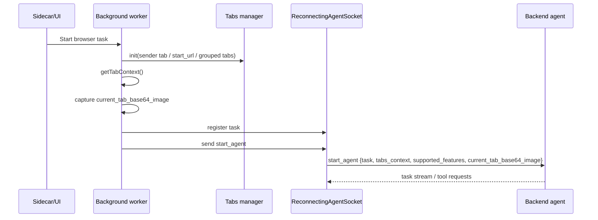
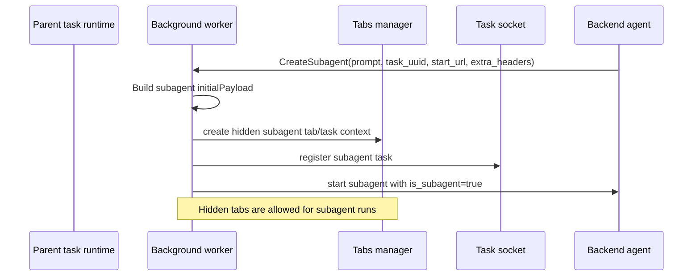
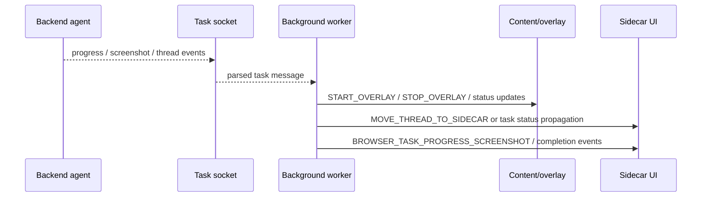
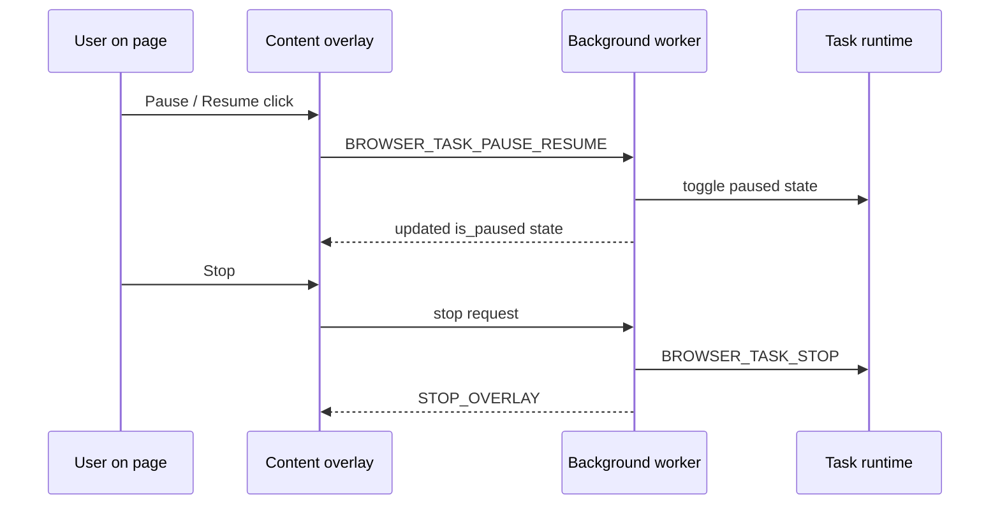
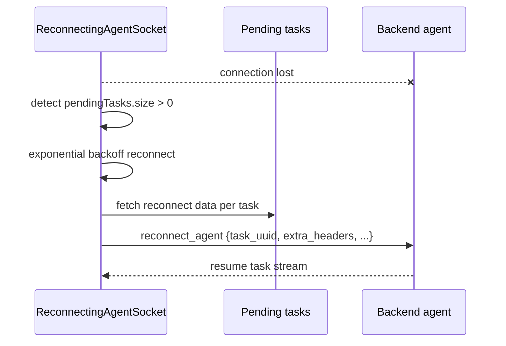
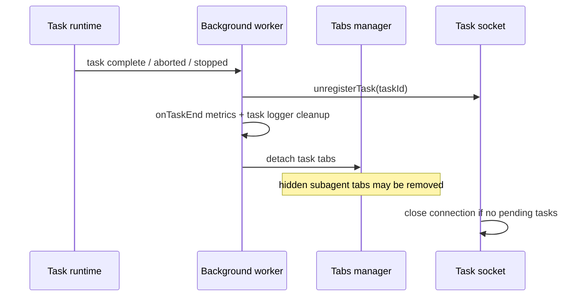

# Comet Agent Lifecycle Sequences

Generated: 2026-03-06

This file records the highest-confidence lifecycle sequences visible in the extracted Comet browser-task sources. Each sequence is limited to behaviors supported by the captured client/runtime evidence.

## 1. Task Start

Evidence:

- `background.js:18040-18105`
- `background.js:14992-15008`

Notes:

- `proven` The task start payload includes `tabs_context`, `current_tab_base64_image`, and `supported_features`.
- `proven` The runtime treats task startup as socket-managed task registration, not just a UI request.

## 2. Subagent Spawn

Evidence:

- `background.js:14519-14551`
- `background.js:14564`
- `background.js:14664`

Notes:

- `proven` Subagents are spawned from a first-class tool path.
- `proven` Subagent runs are marked with `is_subagent: true`.
- `proven` Hidden-tab lifecycle is part of the subagent runtime.

## 3. Progress Updates and Sidecar Coordination

Evidence:

- `background.js:13901, 13921, 13961, 13974`
- `background.js:19747-19871`
- `content.js` overlay message listeners

Notes:

- `proven` Progress screenshots and thread movement are part of the task message family.
- `proven` Overlay and sidecar are coordinated by the background worker, not directly by the backend.

## 4. Pause / Resume / Stop

Evidence:

- `content.js`
- `background.js:14349-14357`
- `background.js:18261-18263`

Notes:

- `proven` Pause/resume is initiated from overlay UI and routed through background control messages.
- `proven` Stop is a dedicated browser-task control path.

## 5. Reconnect

Evidence:

- `background.js:15120-15138`
- `background.js:15185-15257`

Notes:

- `proven` Reconnect is task-aware.
- `proven` Reconnect is skipped if no pending tasks remain.

## 6. Cleanup

Evidence:

- `background.js:14658-14666`
- `background.js:15009-15024`
- `background.js:15307-15308`

Notes:

- `proven` Cleanup is task-scoped and socket-aware.
- `proven` Hidden subagent tabs are removed on destroy.

## Current Repo Contrast

The current repo does not follow the same lifecycle shape end-to-end.

- `proven` It has a single `AgentOrchestrator` run model with pause/resume/stop and reassessment.
- `proven` It has local CDP session recovery and strong overlay plumbing.
- `proven` It does not have:
  - task-scoped reconnectable sockets
  - subagent task spawn and hidden child tabs
  - move-thread-to-sidecar task handoff
  - a task manager separate from the provider transcript

Primary evidence:

- `sidecar/src/agent/orchestrator.ts`
- `src/cdp/session-registry.ts`
- `extension/panel.js`
- `extension/content/agent-overlay.js`
